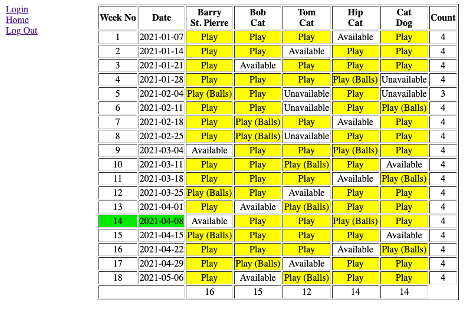

# PCT

## Description
I pay a lot of tennis.  Part of my tennis is weekly tennis with friends at the tennis club I belong to.  They offer  a service they call Permanent Court Time (PCT).  You sign a contract commiting to using the same court every week at the same time. This agreement is in effect from just after Labor Day to the first week in May.  I have had several of these PCTs over the years and the way my groups typically set these up is we overbook the number of players on the contract.  On a given night we will have four players on the court but we will have five in the group so we have enough when some of the members of the group are unable to make it due to a conflict. Sometimes we have even more than five if there are a lot of conflicts for the members.

I created this website to manage the information of who is available which weeks and then scheduling and publishing the schedule.

The website was originally written in PHP version 5.6 (or earlier) and does not use CSS but does use MySQL.  I am slowly working to convert it to version 7.3 functions.  To aid in this I have creaeted a variable named $php_flag.  If this variable is 'TRUE' then the version 5.3 instructions are run, otherwise the 7.3 version instructions
are run.  The converted files are not deployed yet.



## Table of Contents
If your README is long, add a table of contents to make it easy for users to find what they need.
- [Installation](#installation)
- [Usage](#usage)
- [Details](#details)
- [Credits](#credits)
- [License](#license)

## Installation

## Usage

## Details

The webiste consists of a number of files that I list here with the functions they provide:

### index.php

The index.php file sets up the resting state of the website.  It checks to see if a valid user is logged in and if so puts their session id in the variable $valid_user.  It then uses <table> tags to create the layout of the page (this was written in 2006 or earlier and without CSS!).  The file pulls in the navigation menu using an include statement on the nav.php file.  The file then displays the current schedule by including the displayschedule.php file.  I have several PCT court times and my web host that I had when I started this allowed one MySQL database.  To get around this issue, I created multiple versions of the files and tables, one set each for Monday, Wednesdsay and Thursday.  (Did I mention I play a lot of tennis?)  index.php displays links to the three different websites at the bottom of the page to make navigation between the three more convenient.  For purposes of this repository, I created a third version called demo and setup some fake users and tables so readers can explore.  This version does not have links to the other (active) versions.
  
### nav.php  

The file nav.php sets up the menu bar that is displayed along the left side of the screen.  The first thing nav.php does is to check the to see if the server host is the production server or the local test server.  Based on which server is detected, it sets the values in the variables for database access.  These variables incluse $admin for username, $adpass for user password, $database_name for the database name and sets the variable $php_flag for the version of PHP used.  My production server still supports the older version of PHP but my development server no longer does.   

Now that nav.php knows the information to connect to the database server, it creates that connection, with error checking to make sure it was successful.  After the connection is made to the database server, the proper database is selected.  Once all of that is successfully run, a query is made to select the player names.  

There are four levels of access to the schedule.  Anyone can view the schedule.  No login is required.  In that state, the navigation bar displays the following menu items: *Login* and *Home*.  Players who are in the list of players in the database can log in by clicking that link.  

If the player is logged in, the site enters the second level of access. The menu bar adds three additional selections called *Availability*, *Printer Friendly*, and *Log Out*.  The *Availability* link allows the user to go to a page to indicate their availability (whether they are *Available*, *Unavailable*, or *Unknown* (the default setting when the database table for availability was created is *Unknown*)).  The *Printer Friendly* link opens a new tab with just the schedule and none of the navigation items. 

The third level of access is scheduling access.  This is determined by the name of the user and is coded in the nav.php file.  If the user is allowed access to the scheduling functions, they get two additional menu items that are used for managing the data.  These items are *Make Schedule*, and *Manage Users*.  The *Manage Schedules* item allows the scheduler to indicate who is playing on each date through a matrix of drop down menus.  The *Manage Users* item is allows the scheduler to add and remove players.  Players should be added or deleted before the other tables are generated.

The fourt level of access is full access.  This is also controlled by the name of the person logged in.  If the person has full access they will get three more menu items:  *Create Play Dates*, *Create Availability DB*, and *Create Schedule DB*.  The person with this access can create the databases that hold the schedule data.  These functions will overwrite the existing databases.

### displayschedule.php

The file displayschedule.php does the work of displaying the schedule.  At the beginning of the file, displayschedule.php has the same logic as nav.php for setting the variables for accessing the database and creates the connection.  

Once displayschedule.php has access to the database, it gets the names and IDs of the players from the player table.  Next it gets the number of weeks from the table play_dates.  Once it has the number of weeks it loops through the weeks getting the data from the database for each row and filling it in to the HTML as it goes.

For each week it first calulates the current date and time.  It will use this to compare with the dates in the schedule so the next week that is played is highlighted green so it stands out.  I added this because sometimes players would look at the wrong date and either show up when they were not suppose to, or worse, not show up when they were suppose to.  Once it has the current date figured out, it queries the schedule table to pull the player_id and schedule from the table for the week as requested in the for loop.  It then generates the HTML to fill out the table and colors the cell yellow if the player is scheduled to play that week.  This is repeated until all of the weeks have been queried and displayed.  The program also keeps some counts so it can display how many people are scheduled to play each week (if it isn't four than some action needs to be taken to make it four!) and how many times each player is scheduled to play for the session to make it easier to balance the playing time for everyone.

### avail.php

avail.php is called when the user clicks on the *Availability* link.  Like the other files discusssed so far, avail.php gets the session ID and verifies that a valid user is logged in.  It then sets the parameters for the relevant tables.  It next displays the navigation menu on the left side.  Next the page queries the availability table to pull the current availability for the user who is logged in and uses that information to build a web form for the user to use to edit their availability.  Once they have made the adjustments they must click the Update button which submits the form to the availupdate.php script. 

### availupdate.php

availupdate.php completes the same initial housekeeping and then the availability table is updated.  The script then checks the schedule database and updates to take into account the players new availability.  I added this feature because players were updating their availability and not telling me so the schedule would show them as playing still.  One issue with the current logic is the script doesn't know which weeks have been updated.  If the availability table doesn't reflect what happened in the past accurately it could update that data as well.  The only consequence is the count gets thrown off.

Once all the updating is completed, the availability form is displayed again so they can make further changes if required.

### schedule.php

schedule.php is called when the use clicks on the *Make Schedule* link.  After the usual housekeeping chores it builds a form using a table layout.  The form includes every week of play, all of the players and both the availability and the schedule status for each player for each week.  The scheduler can select between *Unknown*, *Unavailable*, *Available*, *Play*, or *Play (Balls)*.  THe last one is for groups that assign someone to bring a can of tennis balls for the week.

Once the person doing the schedule clicks update, the form sends the data to the scheduleupdate.php script.

### scheduleupdate.php

scheduleupdate.php is called by the schedule script when the user clicks on the *Update* button.  After the initial housekeeping, the script looks through each week and each player and updates their status in the schedule.  THen it recreates the update form so the user can make further changes.  I find it useful that it stays in the update mode so I can refresh the play counts for the week and for the players for the session.

### login.php

login.php does the initial housekeeping and then presents a form for the user to enter their user ID and their password.  The user can enter their user ID (I use the part of their email address before the @ symbol so they can remember it easier) and their password and login into the system.

The logic is a bit complicated so I am going to list it here.  

When the person first comes to the login page, userid will not be filled in and the password will not be filled in.  The script will display the login page as shown in item 4, below.

If the user then fills in a userid and a password and clicks *Log In*, the script will follow the logic of item 2, below.

If the user has a userid but does not have a password set in the system, while they are viewing the page from item 4, below, they can enter their userid and leave the password blank and click *Log In*.  This will take them to item 3, below.  The form will reprint asking for the password twice.  When they fill in the password and click *Log In*, the script will take the user through item 1, below, where the two passwords are compared and the rest of the logic of item 1 will play out.

1. Is userid not empty and userid is set and password is not empty and password is set and password confirm is set? 
    - Then does password and password confirm agree? 
        - Then log them into the system and update their password in the system.
    - If the two passwords do not agree, tell them they have to match and show the form again.
1. Is userid not empty and userid is set and password is not empty and password is set?
    - Compare the password to what is stored in the database and log them into the system.
    - Print it is not a valid userid and password and reprint the login form.
1. Is userid not empty and userid is set?
    - Ask the user to set a password and reprint the login form.
1. If none of the above matched, print the login form.
        

### logout.php


### users.php


### makecalendar.php


### CreateAvailabilityDB.php


### CreateScheduleDB.php


## Usage
Provide instructions and examples for use. Include screenshots as needed.
To add a screenshot, create an `assets/images` folder in your repository and upload your screenshot to it. Then, using the relative filepath, add it to your README using the following syntax:
    ```md
    
    ```

## Credits


## License
MIT License

Copyright (c) [2021] [Barry St. Pierre]

Permission is hereby granted, free of charge, to any person obtaining a copy of this software and associated documentation files (the "Software"), to deal in the Software without restriction, including without limitation the rights to use, copy, modify, merge, publish, distribute, sublicense, and/or sell copies of the Software, and to permit persons to whom the Software is furnished to do so, subject to the following conditions:

The above copyright notice and this permission notice shall be included in all copies or substantial portions of the Software.

THE SOFTWARE IS PROVIDED "AS IS", WITHOUT WARRANTY OF ANY KIND, EXPRESS OR IMPLIED, INCLUDING BUT NOT LIMITED TO THE WARRANTIES OF MERCHANTABILITY, FITNESS FOR A PARTICULAR PURPOSE AND NONINFRINGEMENT. IN NO EVENT SHALL THE AUTHORS OR COPYRIGHT HOLDERS BE LIABLE FOR ANY CLAIM, DAMAGES OR OTHER LIABILITY, WHETHER IN AN ACTION OF CONTRACT, TORT OR OTHERWISE, ARISING FROM, OUT OF OR IN CONNECTION WITH THE SOFTWARE OR THE USE OR OTHER DEALINGS IN THE SOFTWARE.


